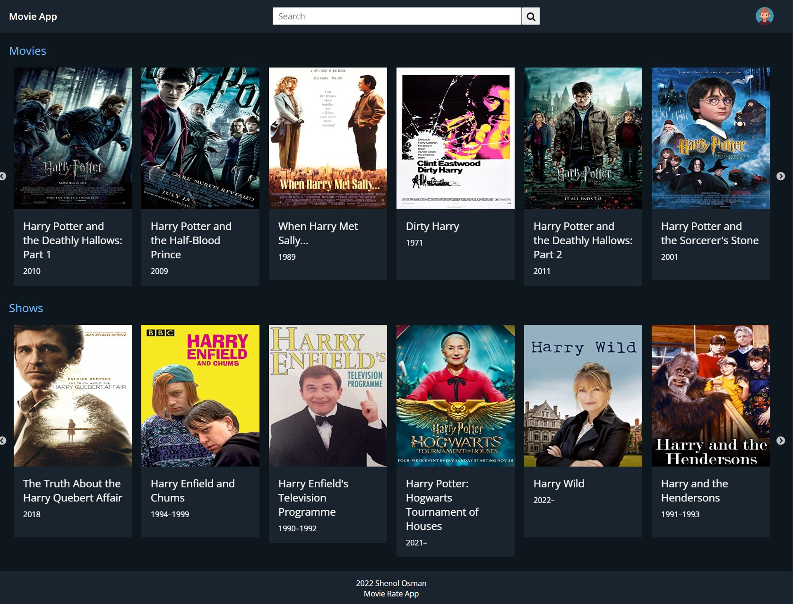
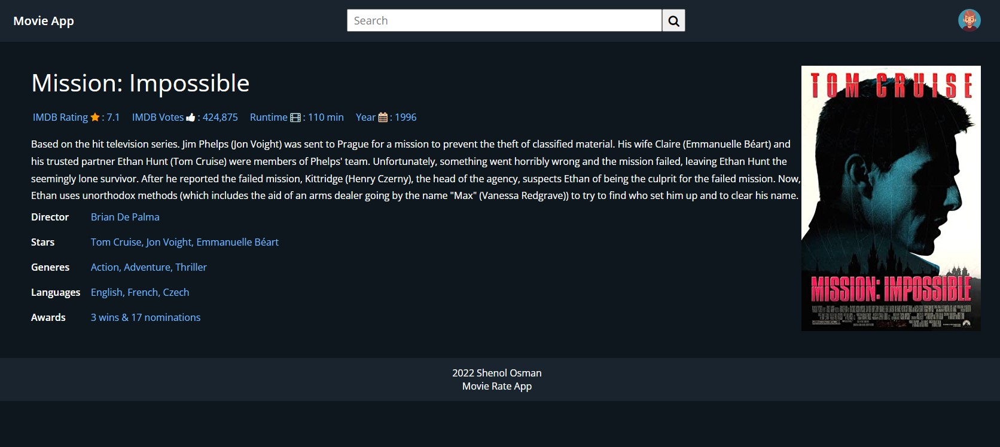

# Movie Rate app 

### fetching data from `https://www.omdbapi.com/`

installed : `npx create-react-app ./`, `npm install node-sass --save` , `npm install axios` , `npm  install react-router-dom@5` , `npm install redux react-redux @reduxjs/toolkit` for carusel `npm install react-slick`

nmp start  `http://localhost:3000`

screenshots:

Home

Detail
